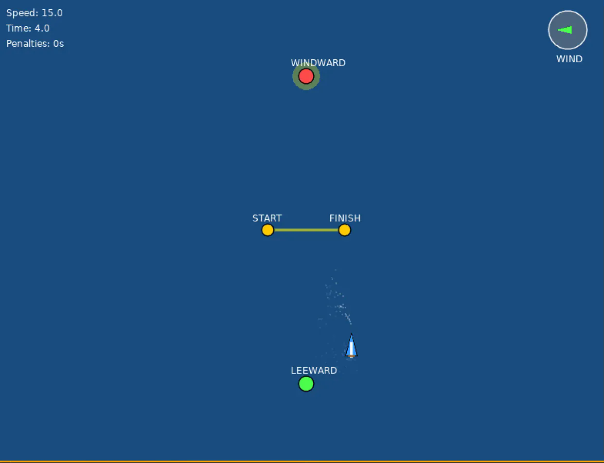

# sailracer



Love2D game written in Lua, 2D sailing around olympic triangle, trapezoid, and windward-leeward courses. Control rudder and sail trim around a course with current and wind physics.

Remake of Scratch 2012 [game](https://scratch.mit.edu/projects/2657604/) 

## Usage
1. Install [Love2D](https://love2d.org/).
2. Download or clone this repository.
3. Run the game using Love2D:

```bash
    cd src/ 
    love .
```

## Development

- Lint: `lx lint`
- Format: `lx fmt`
- Test: `busted`
- Run: `lux run` or `love src/`
